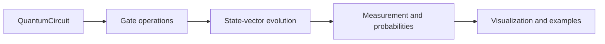

# quantum simulator

> Educational state-vector simulator in Python and NumPy, with circuit composition, measurement, visualization, and testable textbook algorithms.



A small state-vector quantum circuit simulator written in Python + NumPy
for my QC course project. Supports the usual gate set, measurement,
visualization, and a few textbook algorithms.

## install

```
python -m pip install -r requirements.txt
```

## quick start

```python
from qsim import QuantumCircuit

qc = QuantumCircuit(2)
qc.h(0).cnot(0, 1)
print(qc)                       # ascii circuit diagram
print(qc.state.pretty())        # amplitudes
print(qc.probability_dict())    # |amp|^2
print(qc.sample(shots=1000))    # measurement counts
```

## what's in here

```
qsim/
  state.py          QuantumState
  gates.py          gate matrices + apply_gate helper
  circuit.py        QuantumCircuit (fluent builder, diagram)
  visualization.py  Bloch sphere, histogram, state-city
  algorithms.py     Bell / GHZ / teleport / Deutsch-Jozsa / Grover / QFT
examples/           runnable scripts
tests/              pytest
notebooks/          jupyter walkthrough
```

## conventions

- qubit 0 is the most significant bit. `|011>` on 3 qubits = q0=0, q1=1, q2=1.
- state vector is a 1-D complex `numpy` array of length `2**n`.
- gates are applied via reshape + einsum, so memory stays O(2^n).

## run

```
python examples/01_basics.py
python examples/02_bell_and_ghz.py
python examples/03_teleportation.py
python examples/04_deutsch_jozsa.py
python examples/05_grover.py
python examples/06_qft.py
```

## tests

```
python -m pytest tests/
```
